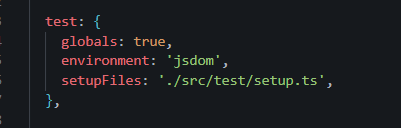
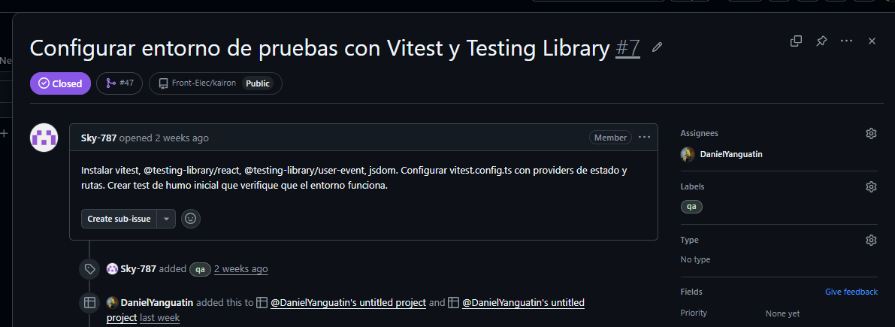
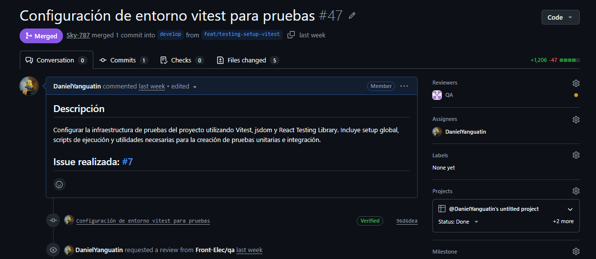
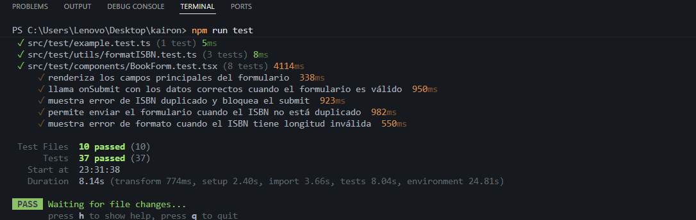
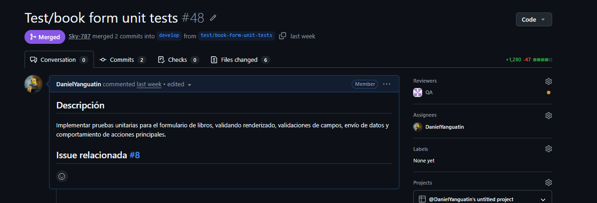

# INFORME TÉCNICO — PROYECTO KAIRON
## Electiva de Frontend · 6to Semestre 2026-1 · Corte 3

---

> **Instrucciones para exportar a PDF:**
> Abrir este archivo en VS Code → instalar extensión "Markdown PDF" → clic derecho → "Markdown PDF: Export (pdf)".
> Cada sección marcada con `📸 [INSERTAR CAPTURA: ...]` debe reemplazarse con la captura de pantalla real antes de exportar.

---

## PORTADA

| Campo | Detalle |
|-------|---------|
| **Proyecto** | Kairon — Sistema de Gestión de Biblioteca |
| **Repositorio** | https://github.com/Front-Elec/kairon |
| **Rama principal** | `main` |
| **Pipeline CI/CD** | Netlify (deploy automático en merge a `main`) |
| **Fecha del informe** | 2026-06-08 |
| **Período cubierto** | 2026-05-27 → 2026-06-08 (13 días) |

### Integrantes del equipo

| # | Nombre | GitHub Handle | Rol en el proyecto |
|---|--------|---------------|--------------------|
| 1 | Alejandro Rodriguez | Sky-787 | DevOps & Git Flow Lead |
| 2 | Daniel Obeimar Yanguatin Jacanamijoy | DanielYanguatin | Testing Lead & QA Reviewer |
| 3 | Camila Arteaga | YutamasPRO | Performance & Optimización |
| 4 | Isabel (Carrillo) | Isabel | State Management & Stores |
| 5 | Farid Castellanos | fqrid | UI Components & Routing |
| 6 | Niyerieth Ruiz | Niye-create | Interactions & Dashboard |

---

## PARTE 1 — BITÁCORA POR FECHAS

### Sesión 1 — 2026-05-27

**Tema:** Arranque del proyecto — Setup inicial, infraestructura Git y CI/CD

| Actividad | Responsable | Issue(s) |
|-----------|-------------|----------|
| Initial commit — repositorio creado en GitHub | Alejandro Rodriguez | — |
| Bootstrap base del proyecto Kairon (scaffold Vite + React + TypeScript) | Alejandro Rodriguez (Sky-787) | #1 |
| Configurar protección de rama `main` y estrategia de branches | Alejandro Rodriguez (Sky-787) | #2 |
| Crear plantilla de Pull Request y etiquetas en GitHub | Alejandro Rodriguez (Sky-787) | #3 |
| Configurar pipeline CI/CD en Netlify (`netlify.toml`) | Alejandro Rodriguez (Sky-787) | #4 |
| Configurar variables de entorno y validación con Zod | Alejandro Rodriguez (Sky-787) | #5 |
| Configurar ESLint sin excepciones para build de producción | Alejandro Rodriguez (Sky-787) | #6 |

**PRs mergeados:** #28, #29, #30, #32, #33, #34

📸 `[INSERTAR CAPTURA: GitHub — vista de los 6 Issues cerrados en la sesión 2026-05-27]`

---

### Sesión 2 — 2026-05-28

**Tema:** Construcción de la UI base — Componentes, Router y Vistas principales

| Actividad | Responsable | Issue(s) |
|-----------|-------------|----------|
| Implementar componentes base: Button, Input, Card, Badge + tokens Tailwind v4 | Farid Castellanos (fqrid) | #12 |
| Setup básico de AppRouter + Navbar con NavLinks | Farid Castellanos (fqrid) | #13 |
| Implementar CatalogPage con grid mobile-first | Farid Castellanos (fqrid) | #14 |
| Implementar vistas restantes: BookDetailPage, StatsPage, AdminPage, LoansPage, NotFoundPage | Farid Castellanos (fqrid) | #15 |
| Conectar todas las vistas al AppRouter y setear 404 personalizado | Farid Castellanos (fqrid) | #13 |

**PRs mergeados:** #31, #35, #36, #37, #38

📸 `[INSERTAR CAPTURA: GitHub — PRs #35 al #38 en estado Merged]`

---

### Sesión 3 — 2026-05-31

**Tema:** Performance — Code Splitting

| Actividad | Responsable | Issue(s) |
|-----------|-------------|----------|
| Implementar code splitting con `React.lazy` y `Suspense` | Camila Arteaga | #7 / performance |

**PRs mergeados:** #39

📸 `[INSERTAR CAPTURA: Código con React.lazy y Suspense aplicado]`

---

### Sesión 4 — 2026-06-01

**Tema:** Performance — Memoización y auditoría Lighthouse

| Actividad | Responsable | Issue(s) |
|-----------|-------------|----------|
| Aplicar memoización con `useMemo` y `useCallback` | Camila Arteaga | #8 / performance |
| Auditoría Lighthouse y optimización de Core Web Vitals | Camila Arteaga | #9 / performance |

**PRs mergeados:** #39 (fusión), #40, #41

📸 `[INSERTAR CAPTURA: Reporte Lighthouse con puntajes de Performance, Accessibility, Best Practices, SEO]`

---

### Sesión 5 — 2026-06-02

**Tema:** Integración de State Management (Stores) e Interacciones

| Actividad | Responsable | Issue(s) |
|-----------|-------------|----------|
| Configurar books store con Zustand + persistencia | Isabel | #20 |
| Configurar loans store con Zustand + persistencia | Isabel | #21 |
| Implementar motor de búsqueda y filtros de libros | Isabel | #22 |
| Implementar formularios, préstamos y gráficas (dashboard integrante 4) | Niyerieth Ruiz (Niye-create) | #55, #56, #57, #58 |

**PRs mergeados:** #42, #43, #44, #45, #46

📸 `[INSERTAR CAPTURA: Zustand DevTools mostrando el store de books y loans activo]`

---

### Sesión 6 — 2026-06-03

**Tema:** Testing — Configuración y pruebas unitarias

| Actividad | Responsable | Issue(s) |
|-----------|-------------|----------|
| Configuración del entorno Vitest para pruebas | Daniel Yanguatin | #47 |
| Implementar pruebas unitarias para el formulario de libros | Daniel Yanguatin | #48 |
| Implementar pruebas para lógica Zustand (loans store) | Daniel Yanguatin | #49 |
| Implementar pruebas del motor de búsqueda y filtros | Daniel Yanguatin | #50 |
| Implementar prueba de pantalla 404 y ruta no encontrada | Daniel Yanguatin | #51 |

**PRs mergeados:** #47, #48, #49, #50, #51, #52

📸 `[INSERTAR CAPTURA: Terminal con resultado de `npm run test` mostrando todas las pruebas en verde]`

---

### Sesión 7 — 2026-06-04

**Tema:** Integración completa — Stores conectados a páginas reales

| Actividad | Responsable | Issue(s) |
|-----------|-------------|----------|
| Integrar catálogo con filtros reales, navegación y detalle de libros | Farid Castellanos (fqrid) | #65 |
| Conectar UI con stores reales y arreglar gráficas | Niyerieth Ruiz (Niye-create) | #55, #56, #57, #58 |
| Integrar catálogo con books store y búsqueda real | Isabel | #59 |
| Unificar modelo de libro en toda la aplicación | Isabel | #60 |
| Integrar BookDetailPage con el store global | Isabel | #61 |
| Integrar LoansPage con los stores globales | Isabel | #62 |
| Conectar estadísticas con datos reales del sistema | Isabel | #63 |

**PRs mergeados:** #64, #65, #66, #67, #68, #69, #70, #71, #72

📸 `[INSERTAR CAPTURA: Netlify deploy en estado "Published" para el merge del 2026-06-04]`

---

### Sesión 8 — 2026-06-07

**Tema:** Auth, ISBN y correcciones de navegación

| Actividad | Responsable | Issue(s) |
|-----------|-------------|----------|
| Auth store con persistencia de sesión | Isabel | #81 |
| ISBN duplicate selector en books store | Isabel | #82 |
| Fix: seed data de ISBN y utilidad formateadora | Isabel | #83 |
| Fix: botón "Ver detalles" no navegaba a `/books/:id` | Camila Arteaga | #84 |
| Integrar validación de ISBN único en formulario | Camila Arteaga | #85 |

**PRs mergeados:** #81, #82, #83, #84, #85

📸 `[INSERTAR CAPTURA: GitHub — Issues #81 al #85 cerrados]`

---

### Sesión 9 — 2026-06-08

**Tema:** Autenticación completa, tests finales y deploy de producción

| Actividad | Responsable | Issue(s) |
|-----------|-------------|----------|
| Página /login y componente ProtectedRoute por rol | Daniel Yanguatin | #86 |
| Validación de ISBN único y formato en formulario | Daniel Yanguatin | #87 |
| Prueba unitaria: flujo de login y control de acceso por rol | Daniel Yanguatin | #88 |
| Exportación de usuarios y préstamos en panel admin (UI) | Daniel Yanguatin | #90 |
| Merge final a `main` — build de producción + deploy Netlify | Daniel Yanguatin (reviewer) | — |

**PRs mergeados:** #86, #87, #88, #89, #90, #91

📸 `[INSERTAR CAPTURA: Netlify dashboard — último deploy en estado "Published" con commit hash del 2026-06-08]`

---

## PARTE 2 — HISTORIAL DE INCIDENCIAS RESUELTAS POR INTEGRANTE

---

## 👤 INTEGRANTE 1 — Alejandro Rodriguez (Sky-787)

**Rol:** DevOps & Git Flow Lead

---

### Issue #1 — Inicializar repositorio y scaffolding base del proyecto

| Campo | Detalle |
|-------|---------|
| **Branch** | `develop` → `main` |
| **PR** | #28 |
| **Fecha** | 2026-05-27 |
| **Commit** | `eef96a2` |

**Trabajo realizado:**
- Scaffold del proyecto con Vite + React 19 + TypeScript
- Estructura de carpetas: `src/pages`, `src/components`, `src/store`, `src/hooks`, `src/types`, `src/config`
- `README.md` con stack y convención de ramas
- Rama `develop` creada como rama de integración

📸 `[INSERTAR CAPTURA 1: VS Code con estructura de carpetas del proyecto abierta]`
📸 `[INSERTAR CAPTURA 2: GitHub Issue #1 en estado "Closed"]`
📸 `[INSERTAR CAPTURA 3: PR #28 mergeado con "Closes #1"]`

---

### Issue #2 — Configurar protección de rama `main`

| Campo | Detalle |
|-------|---------|
| **Branch** | `feature/issue-2-branch-protection` |
| **PR** | #29 |
| **Fecha** | 2026-05-27 |
| **Commit** | `3a1c777` |

**Trabajo realizado:**
- Regla de protección en GitHub: rama `main`, requiere PR + 1 aprobación
- Bloqueo de force push y eliminación de rama
- Convención documentada en `README.md`

📸 `[INSERTAR CAPTURA 1: GitHub Settings → Rules → regla "Proteger main - Kairon" activa]`
📸 `[INSERTAR CAPTURA 2: GitHub Issue #2 en estado "Closed"]`
📸 `[INSERTAR CAPTURA 3: PR #29 mergeado]`

---

### Issue #3 — Plantilla de Pull Request y etiquetas GitHub

| Campo | Detalle |
|-------|---------|
| **Branch** | `feature/issue-3-pr-template` |
| **PR** | #30 |
| **Fecha** | 2026-05-27 |
| **Commit** | `dcbba83` |

**Trabajo realizado:**
- Plantilla `.github/PULL_REQUEST_TEMPLATE.md` con sección `Closes #N`, checklist `lint/build/test`
- Labels creadas: `devops`, `qa`, `ui-ux`, `interactions`, `state`, `performance`, `team`

📸 `[INSERTAR CAPTURA 1: Archivo .github/PULL_REQUEST_TEMPLATE.md]`
📸 `[INSERTAR CAPTURA 2: Labels del repositorio en GitHub]`
📸 `[INSERTAR CAPTURA 3: GitHub Issue #3 en estado "Closed"]`

---

### Issue #4 — Pipeline CI/CD en Netlify

| Campo | Detalle |
|-------|---------|
| **Branch** | `feature/issue-4-netlify-cicd` |
| **PR** | #32 |
| **Fecha** | 2026-05-27 |
| **Commit** | `ccbffad` |

**Trabajo realizado:**
- `netlify.toml` configurado: `npm run build`, `publish = "dist"`, redirect SPA `/* → /index.html`
- README actualizado con sección Netlify

📸 `[INSERTAR CAPTURA 1: netlify.toml abierto en VS Code]`
📸 `[INSERTAR CAPTURA 2: Netlify dashboard con proyecto importado y deploy activo]`
📸 `[INSERTAR CAPTURA 3: GitHub Issue #4 en estado "Closed"]`

---

### Issue #5 — Variables de entorno y validación con Zod

| Campo | Detalle |
|-------|---------|
| **Branch** | `feature/issue-5-env-zod` |
| **PR** | #33 |
| **Fecha** | 2026-05-27 |
| **Commit** | `8d401ef` |

**Trabajo realizado:**
- `src/config/env.ts` validando variables con Zod en tiempo de inicialización
- Tipado estricto de `import.meta.env` en `src/vite-env.d.ts`
- `.env.example` con `VITE_API_BASE_URL`

📸 `[INSERTAR CAPTURA 1: src/config/env.ts con el schema Zod]`
📸 `[INSERTAR CAPTURA 2: GitHub Issue #5 en estado "Closed"]`

---

### Issue #6 — ESLint estricto para build de producción

| Campo | Detalle |
|-------|---------|
| **Branch** | `feature/issue-6-eslint-build` |
| **PR** | #34 |
| **Fecha** | 2026-05-27 |
| **Commit** | `405a725` |

**Trabajo realizado:**
- `eslint.config.js` con reglas `@typescript-eslint/no-unused-vars` y `no-unreachable` en error
- `package.json`: script `build` encadena `lint && tsc -b && vite build`

📸 `[INSERTAR CAPTURA 1: eslint.config.js con reglas reforzadas]`
📸 `[INSERTAR CAPTURA 2: Terminal con `npm run lint` exitoso (0 errores)]`
📸 `[INSERTAR CAPTURA 3: GitHub Issue #6 en estado "Closed"]`

---

## 👤 INTEGRANTE 2 — Daniel Obeimar Yanguatin Jacanamijoy (DanielYanguatin)

**Rol:** Testing Lead & QA Reviewer

---

### Issue #47 — Configuración del entorno Vitest

| Campo | Detalle |
|-------|---------|
| **Branch** | `feat/testing-setup-vitest` |
| **PR** | #47 |
| **Fecha** | 2026-06-03 |
| **Commit** | `96d6dea` |

**Trabajo realizado:**
- Configuración de Vitest con jsdom para testing de componentes React
- Setup de `@testing-library/react` y `@testing-library/user-event`
- Configuración en `vite.config.ts` y `tsconfig` para el entorno de test

📸 `[INSERTAR CAPTURA 1: vite.config.ts con la sección `test` de Vitest]`

📸 `[INSERTAR CAPTURA 2: GitHub Issue #47 en estado "Closed"]`

📸 `[INSERTAR CAPTURA 3: PR #47 mergeado]`

---

### Issue #48 — Pruebas unitarias: formulario de libros

| Campo | Detalle |
|-------|---------|
| **Branch** | `test/book-form-unit-tests` |
| **PR** | #48 |
| **Fecha** | 2026-06-03 |
| **Commit** | `40c376c` |

**Trabajo realizado:**
- Tests para validación de campos del formulario de libros (título, autor, ISBN, categoría)
- Prueba de submit con datos válidos e inválidos
- Cobertura de casos borde (campos vacíos, ISBN duplicado)

📸 `[INSERTAR CAPTURA 1: Archivo de tests del formulario de libros con casos cubiertos]`
📸 `[INSERTAR CAPTURA 2: Terminal con `npm run test` — pruebas en verde para book-form]`

📸 `[INSERTAR CAPTURA 3: GitHub Issue #48 en estado "Closed"]`

---

### Issue #49 — Pruebas unitarias: lógica Zustand (loans store)

| Campo | Detalle |
|-------|---------|
| **Branch** | `test/loans-store-unit-tests` |
| **PR** | #49 |
| **Fecha** | 2026-06-03 |
| **Commit** | `dc316f6` |

**Trabajo realizado:**
- Tests para las acciones del loans store: agregar préstamo, cambiar estado, eliminar
- Verificación de persistencia en localStorage mediante Zustand
- Pruebas de condiciones de borde (store vacío, préstamos duplicados)

📸 `[INSERTAR CAPTURA 1: Código de tests del loans store]`
📸 `[INSERTAR CAPTURA 2: Terminal con pruebas del store pasando en verde]`
📸 `[INSERTAR CAPTURA 3: GitHub Issue #49 en estado "Closed"]`

---

### Issue #50 — Pruebas: motor de búsqueda y filtros

| Campo | Detalle |
|-------|---------|
| **Branch** | `test/book-search-filters` |
| **PR** | #50 |
| **Fecha** | 2026-06-03 |
| **Commit** | `a86a100` |

**Trabajo realizado:**
- Tests para el motor de búsqueda: búsqueda por título, autor, ISBN
- Tests de filtros: por categoría, disponibilidad
- Verificación de resultados vacíos (query sin coincidencias)

📸 `[INSERTAR CAPTURA 1: Código de tests del motor de búsqueda]`
📸 `[INSERTAR CAPTURA 2: Terminal con todas las pruebas de búsqueda en verde]`
📸 `[INSERTAR CAPTURA 3: GitHub Issue #50 en estado "Closed"]`

---

### Issue #51 — Prueba: pantalla 404 y ruta no encontrada

| Campo | Detalle |
|-------|---------|
| **Branch** | `test/not-found-route-tests` |
| **PR** | #51 |
| **Fecha** | 2026-06-03 |
| **Commit** | `75d78bd` |

**Trabajo realizado:**
- Test de navegación a ruta inexistente → renderiza NotFoundPage
- Test de contenido de la página 404 (mensaje, botón de volver al inicio)
- Test de navegación correcta al volver al inicio desde la 404

📸 `[INSERTAR CAPTURA 1: Código del test de ruta no encontrada]`
📸 `[INSERTAR CAPTURA 2: Terminal con prueba 404 en verde]`
📸 `[INSERTAR CAPTURA 3: GitHub Issue #51 en estado "Closed"]`

---

### Issue #86 — Página /login y ProtectedRoute por rol

| Campo | Detalle |
|-------|---------|
| **Branch** | `feature/login-page-protected-route` |
| **PR** | #86 |
| **Fecha** | 2026-06-08 |
| **Commit** | `2d7e012` |

**Trabajo realizado:**
- Maquetación de la página `/login` con formulario (usuario y contraseña)
- Componente `ProtectedRoute` que verifica el rol del usuario en el auth store
- Redirección a `/login` si el usuario no está autenticado
- Redirección a `/forbidden` si el rol no tiene permisos suficientes

📸 `[INSERTAR CAPTURA 1: src/pages/LoginPage.tsx — componente de la página de login]`
📸 `[INSERTAR CAPTURA 2: src/components/ProtectedRoute.tsx — lógica de control por rol]`
📸 `[INSERTAR CAPTURA 3: GitHub Issue #86 en estado "Closed"]`
📸 `[INSERTAR CAPTURA 4: PR #86 mergeado con pipeline Netlify en verde]`

---

### Issue #87 — Validación de ISBN único y formato en formulario

| Campo | Detalle |
|-------|---------|
| **Branch** | `feature/test-isbn-validation` |
| **PR** | #87 |
| **Fecha** | 2026-06-08 |
| **Commit** | `f657829` |

**Trabajo realizado:**
- Validación de formato ISBN-13 (13 dígitos con guiones o sin guiones)
- Detección de ISBN duplicado contra el store de libros en tiempo real
- Mensaje de error específico: "ISBN ya registrado" vs "Formato de ISBN inválido"

📸 `[INSERTAR CAPTURA 1: Código de validación ISBN en el formulario]`
📸 `[INSERTAR CAPTURA 2: UI mostrando el error "ISBN ya registrado" en tiempo real]`
📸 `[INSERTAR CAPTURA 3: GitHub Issue #87 en estado "Closed"]`

---

### Issue #88 — Prueba unitaria: flujo de login y control de acceso por rol

| Campo | Detalle |
|-------|---------|
| **Branch** | `feature/test-auth-roles` |
| **PR** | #88 |
| **Fecha** | 2026-06-08 |
| **Commit** | `6735344` |

**Trabajo realizado:**
- Test del flujo completo de login: submit → autenticación → redirección
- Test de acceso denegado: usuario sin rol de admin intenta acceder a ruta protegida
- Test de logout: limpieza de sesión y redirección a `/login`

📸 `[INSERTAR CAPTURA 1: Código de tests de autenticación y roles]`
📸 `[INSERTAR CAPTURA 2: Terminal con `npm run test` — todas las pruebas de auth en verde]`
📸 `[INSERTAR CAPTURA 3: GitHub Issue #88 en estado "Closed"]`

---

### Issue #90 — Admin: exportación de usuarios y préstamos (UI)

| Campo | Detalle |
|-------|---------|
| **Branch** | `feature/admin-exports-user-loans-ui` |
| **PR** | #90 |
| **Fecha** | 2026-06-08 |
| **Commit** | `54b2c16` |

**Trabajo realizado:**
- Panel de administración con botón "Exportar usuarios" y "Exportar préstamos"
- Generación de archivo CSV con los datos del store
- Descarga automática del CSV en el navegador

📸 `[INSERTAR CAPTURA 1: Panel admin con botones de exportación visibles]`
📸 `[INSERTAR CAPTURA 2: Código del componente de exportación]`
📸 `[INSERTAR CAPTURA 3: GitHub Issue #90 en estado "Closed"]`
📸 `[INSERTAR CAPTURA 4: Netlify pipeline en verde — deploy final de producción]`

---

## 👤 INTEGRANTE 3 — Camila Arteaga (YutamasPRO)

**Rol:** Performance & Optimización

---

### Issue #7 / feat — Code Splitting con React.lazy y Suspense

| Campo | Detalle |
|-------|---------|
| **Branch** | `feat/code-splitting-lazy-suspense` |
| **PR** | #39 |
| **Fecha** | 2026-05-31 |
| **Commit** | `997d9bc` |

**Trabajo realizado:**
- Todas las páginas de la aplicación convertidas a carga diferida con `React.lazy`
- Componente `Suspense` con fallback de loading spinner aplicado en el Router
- Reducción del bundle inicial (chunk splitting por ruta)

📸 `[INSERTAR CAPTURA 1: AppRouter.tsx mostrando las importaciones con React.lazy]`
📸 `[INSERTAR CAPTURA 2: Build output (npm run build) mostrando los chunks separados por ruta]`
📸 `[INSERTAR CAPTURA 3: GitHub Issue / PR #39 en estado "Closed/Merged"]`

---

### Issue #8 / feat — Memoización con useMemo y useCallback

| Campo | Detalle |
|-------|---------|
| **Branch** | `feat/memoization-usememo-usecallback` |
| **PR** | #40 |
| **Fecha** | 2026-06-01 |
| **Commit** | `9a353fa` |

**Trabajo realizado:**
- `useMemo` aplicado en cálculos derivados del catálogo (filtros, ordenamiento)
- `useCallback` en handlers de formularios y callbacks pasados a componentes hijos
- Reducción de re-renders innecesarios verificada con React DevTools Profiler

📸 `[INSERTAR CAPTURA 1: Código con useMemo y useCallback aplicados]`
📸 `[INSERTAR CAPTURA 2: React DevTools Profiler — antes y después de la optimización]`
📸 `[INSERTAR CAPTURA 3: GitHub PR #40 mergeado]`

---

### Issue #9 / feat — Auditoría Lighthouse y Core Web Vitals

| Campo | Detalle |
|-------|---------|
| **Branch** | `feat/lighthouse-core-web-vitals` |
| **PR** | #41 |
| **Fecha** | 2026-06-01 |
| **Commit** | `69907a3` |

**Trabajo realizado:**
- Auditoría completa con Lighthouse en modo Incógnito (desktop y mobile)
- Optimizaciones implementadas según el reporte: imágenes, fuentes, accesibilidad
- Documentación de los scores antes/después

📸 `[INSERTAR CAPTURA 1: Reporte Lighthouse completo con scores de Performance, Accessibility, Best Practices, SEO]`
📸 `[INSERTAR CAPTURA 2: Métricas Core Web Vitals (LCP, FID/INP, CLS) en verde]`
📸 `[INSERTAR CAPTURA 3: GitHub PR #41 mergeado]`

---

### Fix #84 — Botón "Ver detalles" no navegaba a /books/:id

| Campo | Detalle |
|-------|---------|
| **Branch** | `fix/book-detail-navigation` |
| **PR** | #84 |
| **Fecha** | 2026-06-07 |
| **Commit** | `2cc11dd` |

**Trabajo realizado:**
- Bug identificado: el botón usaba `<a href>` en lugar de `useNavigate()` de React Router
- Fix aplicado: reemplazado con el hook `useNavigate` y `navigate(\`/books/${id}\`)`
- Navegación correcta verificada con prueba manual

📸 `[INSERTAR CAPTURA 1: Código corregido del componente con useNavigate]`
📸 `[INSERTAR CAPTURA 2: GitHub Issue #84 en estado "Closed"]`
📸 `[INSERTAR CAPTURA 3: PR #84 mergeado]`

---

### Issue #85 — Integrar validación de ISBN único en formulario

| Campo | Detalle |
|-------|---------|
| **Branch** | `feature/isbn-form-validation` |
| **PR** | #85 |
| **Fecha** | 2026-06-07 |
| **Commit** | `9862cc7` |

**Trabajo realizado:**
- Integración de la validación de ISBN (del store de Isabel) en el formulario de AdminPage
- Feedback visual inmediato al usuario (campo en rojo + mensaje de error)
- Prevención de submit cuando el ISBN ya existe

📸 `[INSERTAR CAPTURA 1: Formulario con campo ISBN mostrando error de duplicado]`
📸 `[INSERTAR CAPTURA 2: Código de integración de la validación en el formulario]`
📸 `[INSERTAR CAPTURA 3: GitHub Issue #85 en estado "Closed"]`

---

## 👤 INTEGRANTE 4 — Isabel Carrillo

**Rol:** State Management & Stores (Zustand)

---

### Issue #20 — Books Store con Zustand y persistencia

| Campo | Detalle |
|-------|---------|
| **Branch** | `feature/issue-20-books-store` |
| **PR** | #44 |
| **Fecha** | 2026-06-02 |
| **Commit** | `e9186eb` |

**Trabajo realizado:**
- Store global de libros con Zustand + `persist` middleware (localStorage)
- Acciones: `addBook`, `updateBook`, `deleteBook`, `getBookById`
- Datos seed iniciales para demostración

📸 `[INSERTAR CAPTURA 1: src/store/booksStore.ts con el store definido]`
📸 `[INSERTAR CAPTURA 2: GitHub Issue #20 en estado "Closed"]`
📸 `[INSERTAR CAPTURA 3: PR #44 mergeado]`

---

### Issue #21 — Loans Store con Zustand y persistencia

| Campo | Detalle |
|-------|---------|
| **Branch** | `feature/issue-21-loans-store` |
| **PR** | #45 |
| **Fecha** | 2026-06-02 |
| **Commit** | `390d526` |

**Trabajo realizado:**
- Store global de préstamos con Zustand + persistencia
- Acciones: `addLoan`, `returnBook`, `getLoansByUser`, `getActiveLoan`
- Estados de préstamo: `active`, `returned`, `overdue`

📸 `[INSERTAR CAPTURA 1: src/store/loansStore.ts con el store y acciones]`
📸 `[INSERTAR CAPTURA 2: GitHub Issue #21 en estado "Closed"]`

---

### Issue #22 — Motor de búsqueda y filtros de libros

| Campo | Detalle |
|-------|---------|
| **Branch** | `feature/issue-22-book-search` |
| **PR** | #46 |
| **Fecha** | 2026-06-02 |
| **Commit** | `a0652d2` |

**Trabajo realizado:**
- Función de búsqueda full-text: título, autor, ISBN, descripción
- Filtros combinables: por categoría, disponibilidad, año
- Integrado directamente en el books store para uso global

📸 `[INSERTAR CAPTURA 1: Código del motor de búsqueda con filtros]`
📸 `[INSERTAR CAPTURA 2: CatalogPage mostrando resultados de búsqueda en tiempo real]`
📸 `[INSERTAR CAPTURA 3: GitHub Issue #22 en estado "Closed"]`

---

### Issue #59 — Catálogo integrado con books store

| Campo | Detalle |
|-------|---------|
| **Branch** | `feature/issue-59-catalog-store` |
| **PR** | #67 |
| **Fecha** | 2026-06-04 |
| **Commit** | `d0c06c6` |

**Trabajo realizado:**
- CatalogPage conectada al books store (datos reales en lugar de hardcoded)
- Búsqueda y filtros conectados al motor del store
- Navegación desde catálogo → detalle de libro funcional

📸 `[INSERTAR CAPTURA 1: CatalogPage con datos del store visible en la UI]`
📸 `[INSERTAR CAPTURA 2: GitHub Issue #59 en estado "Closed"]`

---

### Issue #60 — Unificar modelo de libro en toda la aplicación

| Campo | Detalle |
|-------|---------|
| **Branch** | `feature/issue-60-book-model-consistency` |
| **PR** | #68 |
| **Fecha** | 2026-06-04 |
| **Commit** | `cf49d26` |

**Trabajo realizado:**
- Tipo `Book` unificado en `src/types/book.ts`
- Eliminación de tipos duplicados o inconsistentes entre componentes
- Todas las páginas y stores usando la misma interfaz

📸 `[INSERTAR CAPTURA 1: src/types/book.ts con el tipo unificado]`
📸 `[INSERTAR CAPTURA 2: GitHub Issue #60 en estado "Closed"]`

---

### Issue #61 — BookDetailPage integrada con el store global

| Campo | Detalle |
|-------|---------|
| **Branch** | `feature/issue-61-book-detail-store` |
| **PR** | #69 |
| **Fecha** | 2026-06-04 |
| **Commit** | `44815d0` |

**Trabajo realizado:**
- BookDetailPage obtiene el libro desde el books store usando el `id` de la URL
- Botón "Solicitar préstamo" crea una entrada en el loans store
- Manejo de libro no encontrado (redirect a 404)

📸 `[INSERTAR CAPTURA 1: BookDetailPage mostrando datos reales desde el store]`
📸 `[INSERTAR CAPTURA 2: GitHub Issue #61 en estado "Closed"]`

---

### Issue #62 — LoansPage integrada con stores globales

| Campo | Detalle |
|-------|---------|
| **Branch** | `feature/issue-62-loans-page-store` |
| **PR** | #70 |
| **Fecha** | 2026-06-04 |
| **Commit** | `dd3942a` |

**Trabajo realizado:**
- LoansPage lista los préstamos activos del usuario desde el loans store
- Badges de estado dinámicos: verde/activo, gris/devuelto, rojo/vencido
- Acción de devolución actualiza el store y refleja el cambio en tiempo real

📸 `[INSERTAR CAPTURA 1: LoansPage con tabla de préstamos y badges de estado]`
📸 `[INSERTAR CAPTURA 2: GitHub Issue #62 en estado "Closed"]`

---

### Issue #63 — Estadísticas conectadas con datos reales

| Campo | Detalle |
|-------|---------|
| **Branch** | `feature/issue-63-real-stats` |
| **PR** | #71 |
| **Fecha** | 2026-06-04 |
| **Commit** | `49ae212` |

**Trabajo realizado:**
- StatsPage obtiene métricas calculadas desde los stores (total libros, préstamos activos, vencidos)
- Gráficas conectadas a datos reales del sistema
- Cálculo de métricas derivadas: porcentaje de disponibilidad, libros más prestados

📸 `[INSERTAR CAPTURA 1: StatsPage con gráficas y métricas reales del sistema]`
📸 `[INSERTAR CAPTURA 2: GitHub Issue #63 en estado "Closed"]`

---

### Issue #81 — Auth Store con persistencia de sesión

| Campo | Detalle |
|-------|---------|
| **Branch** | `feature/auth-store` |
| **PR** | #81 |
| **Fecha** | 2026-06-07 |
| **Commit** | `ab2b6b4` |

**Trabajo realizado:**
- `authStore` con Zustand + persistencia: `user`, `role`, `isAuthenticated`
- Acciones: `login(credentials)`, `logout()`, `hasRole(role)`
- Sesión persistida en localStorage (sobrevive recarga de página)

📸 `[INSERTAR CAPTURA 1: src/store/authStore.ts con la definición del store]`
📸 `[INSERTAR CAPTURA 2: GitHub Issue #81 en estado "Closed"]`

---

### Fix #83 — Seed data de ISBN y utilidad formateadora

| Campo | Detalle |
|-------|---------|
| **Branch** | `fix/isbn-format-seed-data` |
| **PR** | #83 |
| **Fecha** | 2026-06-07 |
| **Commit** | `c57328d` |

**Trabajo realizado:**
- Corrección de los ISBNs en los datos seed (formato ISBN-13 correcto)
- Utilidad `formatISBN(isbn: string)` para normalizar la visualización
- Función de validación `isValidISBN(isbn: string)` reutilizable

📸 `[INSERTAR CAPTURA 1: Código de la utilidad formatISBN y isValidISBN]`
📸 `[INSERTAR CAPTURA 2: GitHub Issue #83 (o PR #83) en estado "Closed/Merged"]`

---

### Issue #82 — ISBN Duplicate Selector en books store

| Campo | Detalle |
|-------|---------|
| **Branch** | `feature/isbn-duplicate-selector` |
| **PR** | #82 |
| **Fecha** | 2026-06-07 |
| **Commit** | `61e9793` |

**Trabajo realizado:**
- Selector `isISBNDuplicate(isbn: string)` añadido al books store
- Verifica en O(1) usando un Set interno de ISBNs registrados
- Exportado para uso directo en formularios y validaciones

📸 `[INSERTAR CAPTURA 1: books store mostrando el selector isISBNDuplicate]`
📸 `[INSERTAR CAPTURA 2: GitHub Issue #82 en estado "Closed"]`

---

## 👤 INTEGRANTE 5 — Farid Castellanos (fqrid)

**Rol:** UI Components & Routing

---

### Issue #12 — Componentes UI base y sistema de diseño

| Campo | Detalle |
|-------|---------|
| **Branch** | `feature/ui-base-and-layout` |
| **PR** | #35 |
| **Fecha** | 2026-05-28 |
| **Commit** | `81d85c2` |

**Trabajo realizado:**
- Componentes base: `Button`, `Input`, `Card`, `Badge` en `src/components/ui/`
- Tokens de tema Tailwind v4: colores, tipografía, espaciado, radios
- Componentes tipados con variantes (Button: `primary`, `secondary`, `danger`)

📸 `[INSERTAR CAPTURA 1: src/components/ui/ con los componentes creados]`
📸 `[INSERTAR CAPTURA 2: Storybook o UI visual mostrando los componentes Button, Card, Badge]`
📸 `[INSERTAR CAPTURA 3: GitHub Issue #12 / PR #35 en estado "Closed/Merged"]`

---

### Issue #13 — AppRouter y Navbar

| Campo | Detalle |
|-------|---------|
| **Branch** | `feature/issue-13-app-routing` |
| **PR** | #36 |
| **Fecha** | 2026-05-28 |
| **Commit** | `1a8ac0a` |

**Trabajo realizado:**
- `AppRouter` con React Router v6: rutas para todas las páginas de la aplicación
- `Navbar` con `NavLink` y estado activo visual
- Ruta catch-all `*` → `NotFoundPage`

📸 `[INSERTAR CAPTURA 1: src/router/AppRouter.tsx con todas las rutas definidas]`
📸 `[INSERTAR CAPTURA 2: Navbar en el navegador con el enlace activo resaltado]`
📸 `[INSERTAR CAPTURA 3: GitHub Issue #13 / PR #36 en estado "Closed/Merged"]`

---

### Issue #14 — CatalogPage layout mobile-first

| Campo | Detalle |
|-------|---------|
| **Branch** | `feature/issue-14-catalog-page` |
| **PR** | #37 |
| **Fecha** | 2026-05-28 |
| **Commit** | `7eeda3e` |

**Trabajo realizado:**
- Grid responsivo mobile-first: 1 columna (móvil) → 2 (tablet) → 3/4 (desktop)
- Cards de libros con imagen, título, autor, categoría y badge de disponibilidad
- Barra de búsqueda y filtro por categoría en la cabecera

📸 `[INSERTAR CAPTURA 1: CatalogPage en móvil (1 columna)]`
📸 `[INSERTAR CAPTURA 2: CatalogPage en desktop (grid de 3-4 columnas)]`
📸 `[INSERTAR CAPTURA 3: GitHub Issue #14 / PR #37 en estado "Closed/Merged"]`

---

### Issue #15 — Vistas restantes: BookDetail, Stats, Admin, Loans, NotFound

| Campo | Detalle |
|-------|---------|
| **Branch** | `feature/issue-15-remaining-views` |
| **PR** | #38 |
| **Fecha** | 2026-05-28 |
| **Commit** | `b775493` |

**Trabajo realizado:**
- `BookDetailPage`: card de detalle con imagen, info del libro y botón de solicitud
- `StatsPage`: layout con gráficas y métricas (datos mock iniciales)
- `AdminPage`: formulario de alta de libros con campos tipados
- `LoansPage`: tabla de préstamos con badges de estado
- `NotFoundPage`: página 404 con botón de vuelta al inicio

📸 `[INSERTAR CAPTURA 1: BookDetailPage en el navegador]`
📸 `[INSERTAR CAPTURA 2: AdminPage con el formulario de libros]`
📸 `[INSERTAR CAPTURA 3: LoansPage con la tabla de préstamos]`
📸 `[INSERTAR CAPTURA 4: GitHub PR #38 mergeado]`

---

### Issue #65 — Integrar catálogo con filtros reales y pantalla de detalle

| Campo | Detalle |
|-------|---------|
| **Branch** | `feature/catalog-detail-integration` |
| **PR** | #65 |
| **Fecha** | 2026-06-04 |
| **Commit** | `904edb9` |

**Trabajo realizado:**
- Filtros del catálogo conectados al motor de búsqueda real del books store
- Navegación desde catálogo → detalle con paso de `id` por URL (`/books/:id`)
- Pantalla de detalle carga los datos del libro desde el store por ID

📸 `[INSERTAR CAPTURA 1: Catálogo con filtro activo mostrando resultados filtrados]`
📸 `[INSERTAR CAPTURA 2: Flujo de navegación Catálogo → Detalle de libro]`
📸 `[INSERTAR CAPTURA 3: GitHub Issue #65 / PR #65 en estado "Closed/Merged"]`

---

## 👤 INTEGRANTE 6 — Niyerieth Ruiz (Niye-create)

**Rol:** Interactions & Dashboard

---

### Issues #55, #56, #57, #58 — Formularios, préstamos y gráficas

| Campo | Detalle |
|-------|---------|
| **Branch** | `feature/interacciones-integrante-4` |
| **PR** | #43 |
| **Fecha** | 2026-06-02 |
| **Commit** | `517ef10` |

**Trabajo realizado:**
- Formularios interactivos: solicitud de préstamo, devolución de libro
- Panel de préstamos con tabla y acciones (solicitar, devolver, ver historial)
- Gráficas del dashboard: libros por categoría, préstamos por mes

📸 `[INSERTAR CAPTURA 1: Formulario de solicitud de préstamo funcional]`
📸 `[INSERTAR CAPTURA 2: Dashboard con las gráficas de estadísticas]`
📸 `[INSERTAR CAPTURA 3: GitHub Issues #55, #56, #57, #58 en estado "Closed"]`
📸 `[INSERTAR CAPTURA 4: PR #43 mergeado]`

---

### Fix #55-#58 — Conectar UI con stores reales y arreglar gráficas

| Campo | Detalle |
|-------|---------|
| **Branch** | `fix/conexiones-store-ui` |
| **PR** | #64 |
| **Fecha** | 2026-06-04 |
| **Commit** | `30c6d81` |

**Trabajo realizado:**
- Migración de todas las páginas del dashboard a usar los stores reales de Zustand
- Gráficas de Recharts/Chart.js conectadas a datos reales del sistema
- Corrección de bugs en las gráficas (datos no actualizaban al cambiar el store)

📸 `[INSERTAR CAPTURA 1: StatsPage con gráficas mostrando datos reales (no mock)]`
📸 `[INSERTAR CAPTURA 2: Código del componente de gráfica conectado al store]`
📸 `[INSERTAR CAPTURA 3: GitHub PR #64 mergeado]`

---

## PARTE 3 — RESUMEN ESTADÍSTICO DEL PROYECTO

| Métrica | Valor |
|---------|-------|
| **Total de commits** | 91+ |
| **Total de Pull Requests mergeados** | 45+ |
| **Issues cerrados** | 35+ |
| **Período de desarrollo** | 13 días (2026-05-27 → 2026-06-08) |
| **Rama de integración** | `develop` |
| **Rama de producción** | `main` |
| **Deploy** | Netlify (CI/CD automático) |

### Distribución de trabajo por integrante

| Integrante | PRs | Área principal |
|------------|-----|----------------|
| Alejandro Rodriguez | 6 | DevOps, CI/CD, ESLint, Env |
| Daniel Yanguatin | 8 | Testing (Vitest), Auth, Admin |
| Camila Arteaga | 5 | Performance, Code Splitting, Fix nav |
| Isabel Carrillo | 10 | Stores Zustand, Search, Auth Store |
| Farid Castellanos | 5 | UI Components, Router, Catalog |
| Niyerieth Ruiz | 2 | Interactions, Dashboard, Gráficas |

---

## PARTE 4 — EVIDENCIA DEL PIPELINE CI/CD

📸 `[INSERTAR CAPTURA: Netlify — lista de todos los deploys exitosos del proyecto (pantalla de "Deploys" en el dashboard de Netlify)]`

📸 `[INSERTAR CAPTURA: Netlify — último deploy "Published" con el hash del commit del 2026-06-08]`

📸 `[INSERTAR CAPTURA: GitHub Actions / Checks — PRs con checks en verde (si aplica)]`

---

*Documento generado a partir del historial oficial de Git del repositorio Front-Elec/kairon — 2026-06-08*
