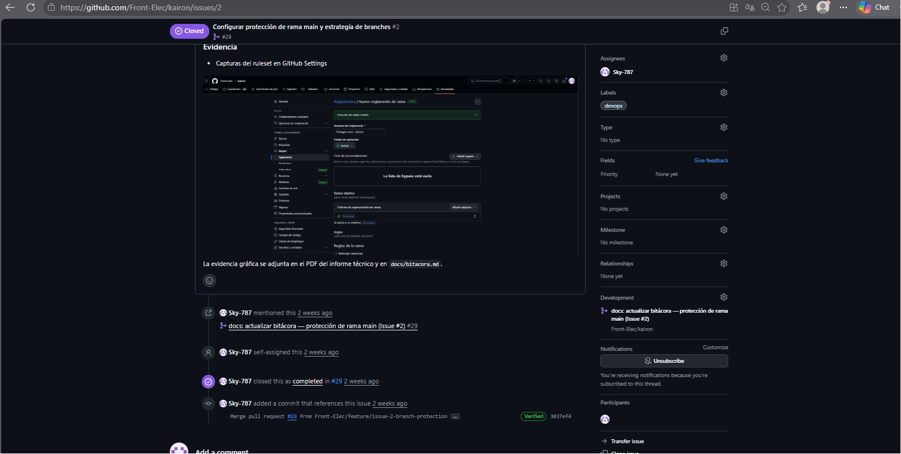

# Bitácora — Kairon

> **Dónde van las capturas:** en el **PDF del informe técnico** (y opcionalmente en un comentario del PR).  
> **No** es obligatorio pegar imágenes dentro del Issue en GitHub; ahí basta texto + link al PR.

---

## Sesión 2026-05-27 — Issue #1

| Campo | Detalle |
|-------|---------|
| **Integrante** | Alejandro Rodriguez - Sky-787 |
| **Rol** | Integrante 1 — DevOps & Git Flow Lead |
| **Issue** | #1 — Inicializar repositorio y scaffolding base del proyecto |
| **Rama** | `develop` |
| **PR** | [Pegar URL del PR cuando esté mergeado] |

### Trabajo realizado
- Scaffold React + Vite + TypeScript en la raíz del repo `kairon`
- Estructura de carpetas: `src/pages`, `src/components`, `src/store`, `src/hooks`, `src/types`, `src/config`
- `README.md` actualizado con stack y convención de ramas
- Rama `develop` creada para integración

### Comandos ejecutados (evidencia en terminal)
```bash
npm install
npm run lint
npm run build
```
### Evidencia para el PDF (capturas de pantalla)
| # | Qué capturar | Issue |
|---|--------------|-------|
| 1 | Explorador de archivos / VS Code con carpetas `src/`, `package.json`, `vite.config.ts` | #1 |
| 2 | Terminal después de `npm run lint` (sin errores) | #1 |
| 3 | Terminal después de `npm run build` (línea `✓ built in ...`) | #1 |
| 4 | GitHub Issue #1 (estado Closed) | #1 |
| 5 | Pull Request con `Closes #1` | #1 |


---

## Sesión 2026-05-27 — Issue #2

| Campo | Detalle |
|-------|---------|
| **Integrante** | Alejandro Rodriguez - Sky-787 |
| **Rol** | Integrante 1 — DevOps & Git Flow Lead |
| **Issue** | #2 — Configurar protección de rama `main` y estrategia de branches |
| **Rama** | `feature/issue-2-branch-protection` |
| **PR** | [Pegar URL del PR cuando esté mergeado] |

### Trabajo realizado
- Reglamento de rama en GitHub: **Proteger main - Kairon**
- Rama objetivo: `main`
- Reglas activas:
  - Requiere Pull Request antes de merge
  - Mínimo **1 aprobación** requerida (equipo QA para revisión)
  - Bloqueo de force push
  - Restricción de eliminación de rama
- Convención documentada en `README.md`: `main` / `develop` / `feature/*`

### Evidencia para el PDF (capturas de pantalla)
| # | Qué capturar | Issue |
|---|--------------|-------|
| 1 | GitHub → Settings → Rules: reglamento **Proteger main - Kairon** activo | #2 |
| 2 | Detalle del reglamento con rama `main` y reglas marcadas | #2 |
| 3 | Detalle de “Requiere PR” con **1 aprobación** | #2 |
| 4 | GitHub Issue #2 (estado Closed) | #2 |
| 5 | Pull Request con `Closes #2` aprobado por QA | #2 |
| 6 | (Opcional) Terminal con push directo a `main` rechazado | #2 |



### Notas
- **Netlify deploy** → Issue #4
- **Plantilla PR / labels** → Issue #3

---

## Sesión 2026-05-27 — Issue #3

| Campo | Detalle |
|-------|---------|
| **Integrante** | Alejandro Rodriguez - Sky-787 |
| **Rol** | Integrante 1 — DevOps & Git Flow Lead |
| **Issue** | #3 — Crear plantilla de Pull Request y etiquetas en GitHub |
| **Rama** | `feature/issue-3-pr-template` |
| **PR** | [Pegar URL del PR cuando esté mergeado] |

### Trabajo realizado
- Plantilla de PR actualizada en `.github/PULL_REQUEST_TEMPLATE.md`
- Sección de issue relacionado con `Closes #N`
- Sección de validación de pruebas (`¿Qué se probó?`)
- Checklist reforzado: `lint`, `build`, `test` (si aplica) y evidencia
- Labels de GitHub ya creadas en el repositorio

### Evidencia para el PDF (capturas de pantalla)
| # | Qué capturar | Issue |
|---|--------------|-------|
| 1 | Archivo `.github/PULL_REQUEST_TEMPLATE.md` actualizado | #3 |
| 2 | PR con `Closes #3` | #3 |
| 3 | GitHub Issue #3 (estado Closed) | #3 |
| 4 | Labels del repositorio (`devops`, `qa`, `ui-ux`, `interactions`, `state`, `performance`, `team`) | #3 |


---

## Sesión 2026-05-27 — Issue #4

| Campo | Detalle |
|-------|---------|
| **Integrante** | Alejandro Rodriguez - Sky-787 |
| **Rol** | Integrante 1 — DevOps & Git Flow Lead |
| **Issue** | #4 — Configurar pipeline CI/CD en Netlify |
| **Rama** | `feature/issue-4-netlify-cicd` |
| **PR** | [Pegar URL del PR cuando esté mergeado] |

### Trabajo realizado
- Configuración de Netlify validada en `netlify.toml`:
  - `command = "npm run build"`
  - `publish = "dist"`
  - Redirect SPA `/* -> /index.html`
- `README.md` actualizado con sección Netlify y checklist operativo
- Pipeline local validado con `npm run build`

### Pendiente manual en plataforma Netlify
- Importar el repositorio en Netlify
- Configurar variable de entorno `VITE_API_BASE_URL`
- Confirmar deploy automático en merge a `main`

### Evidencia para el PDF (capturas de pantalla)
| # | Qué capturar | Issue |
|---|--------------|-------|
| 1 | Archivo `netlify.toml` con build/publish/redirect | #4 |
| 2 | README con sección "Netlify (Issue #4)" | #4 |
| 3 | Netlify dashboard con proyecto conectado | #4 |
| 4 | Deploy en estado Published / Success | #4 |
| 5 | GitHub Issue #4 (estado Closed) | #4 |


---

## Sesión 2026-05-27 — Issue #5

| Campo | Detalle |
|-------|---------|
| **Integrante** | Alejandro Rodriguez - Sky-787 |
| **Rol** | Integrante 1 — DevOps & Git Flow Lead |
| **Issue** | #5 — Configurar variables de entorno y validación con Zod |
| **Rama** | `feature/issue-5-env-zod` |
| **PR** | [Pegar URL del PR cuando esté mergeado] |

### Trabajo realizado
- Validación de variables de entorno con Zod en `src/config/env.ts`
- Manejo de error legible cuando falta o es inválida una variable
- Tipado estricto de `import.meta.env` en `src/vite-env.d.ts`
- Documentación en `README.md` (sección Issue #5)
- `.env.example` ya incluido con `VITE_API_BASE_URL`

### Evidencia para el PDF (capturas de pantalla)
| # | Qué capturar | Issue |
|---|--------------|-------|
| 1 | `.env.example` con `VITE_API_BASE_URL` | #5 |
| 2 | `src/config/env.ts` validando con Zod | #5 |
| 3 | `src/vite-env.d.ts` con tipado de variables | #5 |
| 4 | README con sección "Variables de entorno (Issue #5)" | #5 |
| 5 | PR con `Closes #5` + Issue #5 cerrada | #5 |

---

## Sesión 2026-05-27 — Issue #6

| Campo | Detalle |
|-------|---------|
| **Integrante** | Alejandro Rodriguez - Sky-787 |
| **Rol** | Integrante 1 — DevOps & Git Flow Lead |
| **Issue** | #6 — Configurar ESLint sin excepciones para build de producción |
| **Rama** | `feature/issue-6-eslint-build` |
| **PR** | [Pegar URL del PR cuando esté mergeado] |

### Trabajo realizado
- Reglas ESLint reforzadas en `eslint.config.js`
  - `@typescript-eslint/no-unused-vars` en error
  - `no-unreachable` en error
- Build encadenado con lint en `package.json`:
  - `npm run build` ahora ejecuta `npm run lint && tsc -b && vite build`
- Documentación actualizada en README (sección Issue #6)
- Validación local de `npm run lint` y `npm run build`

### Evidencia para el PDF (capturas de pantalla)
| # | Qué capturar | Issue |
|---|--------------|-------|
| 1 | `eslint.config.js` con reglas reforzadas | #6 |
| 2 | `package.json` mostrando script `build` con lint previo | #6 |
| 3 | Terminal con `npm run lint` exitoso | #6 |
| 4 | Terminal con `npm run build` exitoso (incluyendo lint) | #6 |
| 5 | PR con `Closes #6` + Issue #6 cerrada | #6 |

